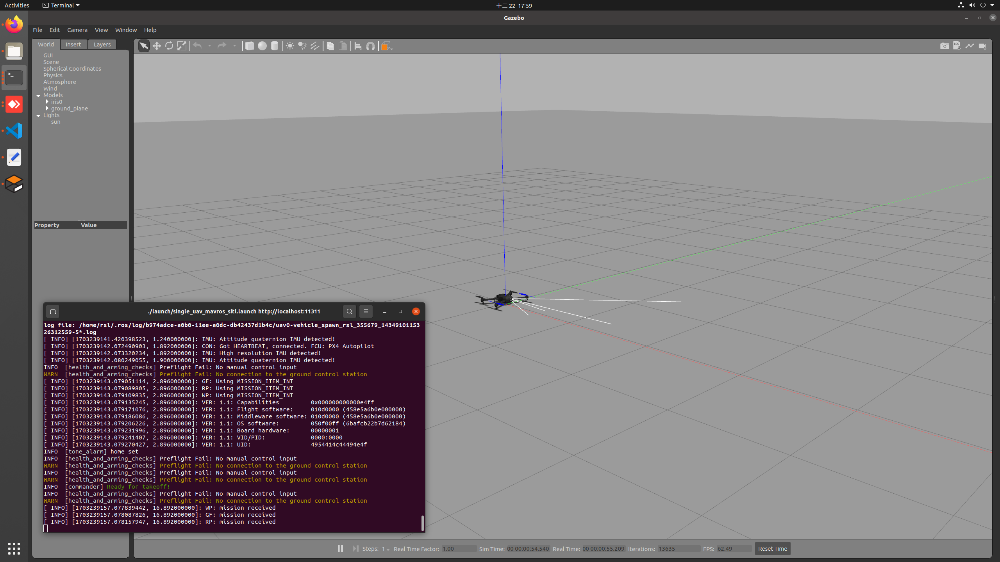

# Iris UAV on Gazebo

## Environment Setup
### Install ROS
Refer to [Ubuntu install of ROS Noetic.](http://wiki.ros.org/noetic/Installation/Ubuntu)

### Packages
There are a few packages to download.

```
sudo apt install ros-noetic-geographic-msgs ros-noetic-mavlink
sudo apt install geographiclib-*
sudo apt install libgeographic-*
sudo apt-get install ros-${ROS_DISTRO}-mavros ros-${ROS_DISTRO}-mavros-extras ros-${ROS_DISTRO}-mavros-msgs
wget https://raw.githubusercontent.com/mavlink/mavros/master/mavros/scripts/install_geographiclib_datasets.sh
sudo bash ./install_geographiclib_datasets.sh   
```

Ref: https://docs.px4.io/main/en/ros/mavros_installation.html#binary-installation-debian-ubuntu

Unzip tools.zip, move all folders to your `catkin_ws/src` folder and run `catkin build`.

### PX4 Drone Autopilot
Install prerequisite packages.
```
pip3 install kconfiglib
pip3 install --user jinja2
pip3 install --user packaging
pip3 install --user jsonschema
sudo apt-get install libgstreamer1.0-dev libgstreamer-plugins-base1.0-dev
```

Clone PX4 Autopilot repo from [here](https://github.com/yanshuolee/PX4-Autopilot).
```
git clone https://github.com/yanshuolee/PX4-Autopilot.git
git submodule update --init --recursive
DONT_RUN=1 make px4_sitl_default gazebo
```

Source your environment.
```
source Tools/setup_gazebo.bash $(pwd) $(pwd)/build/px4_sitl_default
export ROS_PACKAGE_PATH=$ROS_PACKAGE_PATH:$(pwd):$(pwd)/Tools/sitl_gazebo
```

Move the revised iris drone with realsense camera to model folder.
```
# bespoke iris drone
cp ./assets/iris-basic.sdf.jinja ./Tools/simulation/gazebo/sitl_gazebo/models/iris/iris-basic-1.sdf.jinja

# realsense camera
cp -r ./assets/d435 ./Tools/simulation/gazebo/sitl_gazebo/models/d435
```

Note that you can modify any drone parameters in `iris-basic-1.sdf.jinja`.

Ref: https://docs.px4.io/v1.12/en/simulation/multi_vehicle_simulation_gazebo.html#build-and-test


## Single UAV flight
Go to root directory of PX4-Autopilot and start an empty environment with roslaunch command.
```
cd PX4-Autopilot
roslaunch ./launch/single_uav_mavros_sitl.launch
```



Start with another terminal and go to `~/catkin_ws/src/multiuav/scripts` to control the drone with Python code.
```
cd ~/catkin_ws/src/multiuav/scripts
python uav-single.py
```